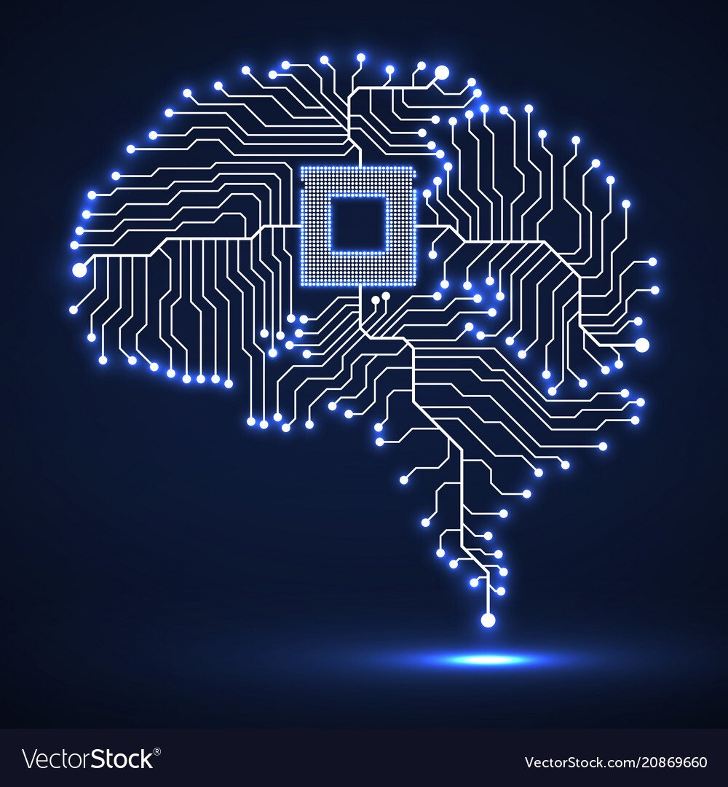

<link href="style.css" rel="stylesheet"></link>

# Intro to Computers

## The Purpose of this Section
The purpose of this section is to introduce you to the following concepts:

- What is hardware?
- What is a computer?
- What are the components of a computer?
- What is a Raspberry Pi?

## What is a Computer?

A computer is an electronic device that manipulates information or data. The computer sees data as 1s and 0s, but it knows how to combine them to create much more complex things like photos, movies, websites, games, and much more.

Computers can be defined as any device that can:

1. Accept an input
2. Perform calculations based on that input
3. Provide an appropriate output

A computer system consists of two major elements, hardware and software. In this lesson, you are going to learn about hardware.

## What is Hardware?

**Hardware** refers to the physical elements that make up a computer. These are the <ins>components that you can physically touch.</ins>

Computers are composed of several hardware components. Some might be more familiar than others. In this lesson, you will learn to recognize some of the different components of a computer and begin to understand what they do.

## Core Components of a Computer

### 1. Processer

#### Key Terms
- Central Processing Unit (CPU)
- Arithmetic Logic Unit (ALU)
- Control Unit (CU)

Processors are the components in computers that process and execute inputs received from hardware and software. This term can also be referenced as the Central Processing Unit. 

The CPU is thought of as the brain of the computer. 

<!--  -->

    

We all know how the human brain works: it receives information, processes it, and responds to it by doing something. The CPU works in the same way. All of the inputs from the other parts of the computer are sent to the CPU, where it processes the information it receives and it sends the output as a response.

There are two components that make up the CPU, the **control unit** and the **arithmetic logic unit (ALU)**. 

The control unit is a digital circuit that directs operations within a computer's processor. The ALU is a <ins>digital circuit</ins> inside the processor that <ins>handles arithmetic and logical operations.</ins>

The following list describes how the control unit and the ALU work together to perform basic CPU functions:
1. First the control unit receives instructions from another part of the computer and decodes the instructions into commands. 
2. Then the control unit provides the ALU with these commands so that the ALU can execute them.
3. Finally the ALU returns information back to the control unit, and the control unit returns the data back to the other part of the computer.

Isn’t that process strangely familiar? First there is an input received, then a calculation is performed, and then an output is provided..Oh yeah! This is pretty much the same process described earlier in the lesson as the three basic functions of a computer. 

However, the question still remains: What component is performing that input and receiving that output? In the next section you will learn about memory.

### RAM
**Key Terms**
- Random Access Memory (RAM): <!-- Insert Definition 
Here -->
- Volatile Memory: <!-- Insert Definition Here -->

### Internal Storage
**Key Terms**
- Hard Drive: <!-- Insert Definition Here -->
- Non-Volatile Memory: <!-- Insert Definition Here -->
- Fard Disk Drive (HDD): <!-- Insert Definition Here -->
- Solid State Drive (SSD): <!-- Insert Definition Here -->

### Motherboard
**Key Terms**

### Input Devices
**Key Terms**

<!-- Insert Image Here -->

### Output Devices
**Key Terms**
<!-- Insert Image Here -->
