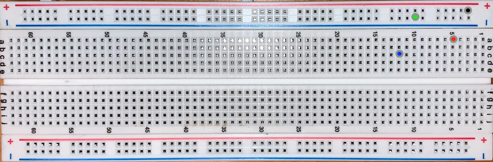
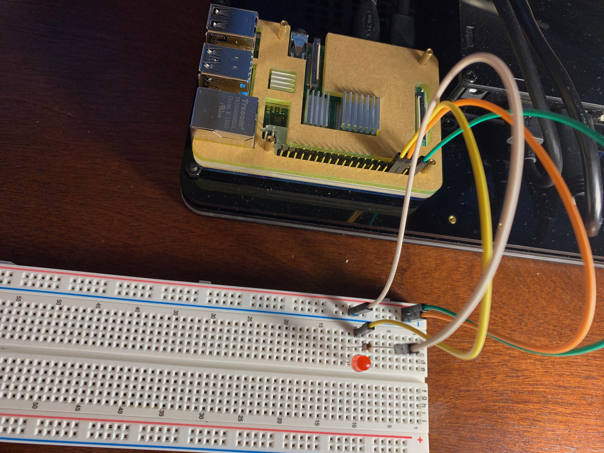
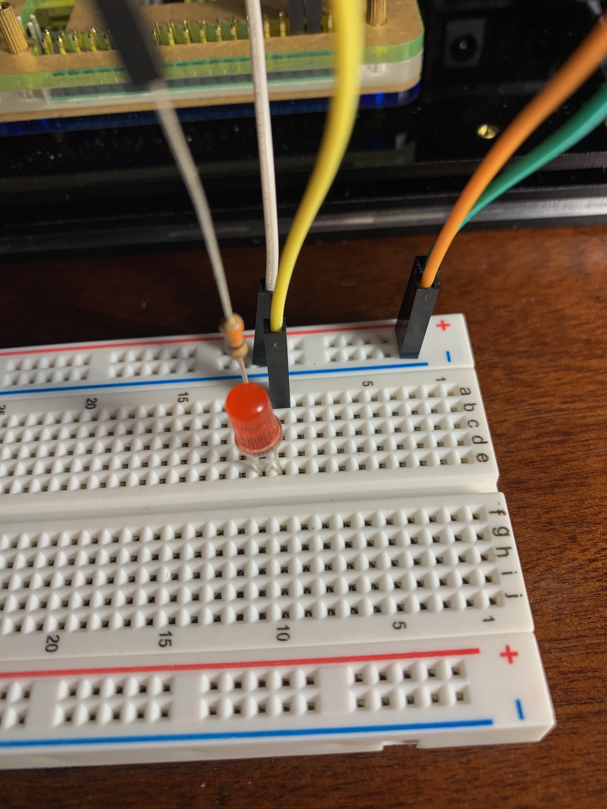
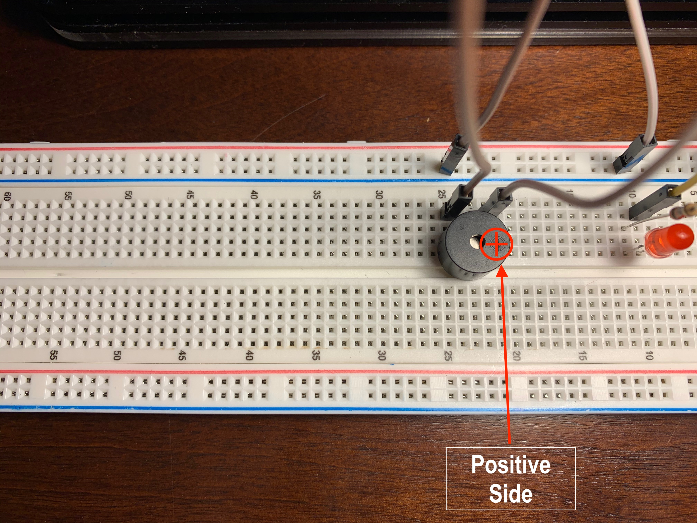
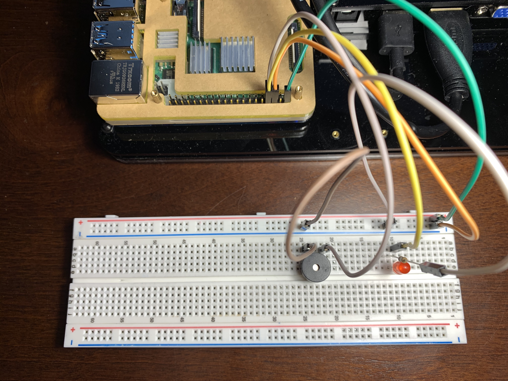
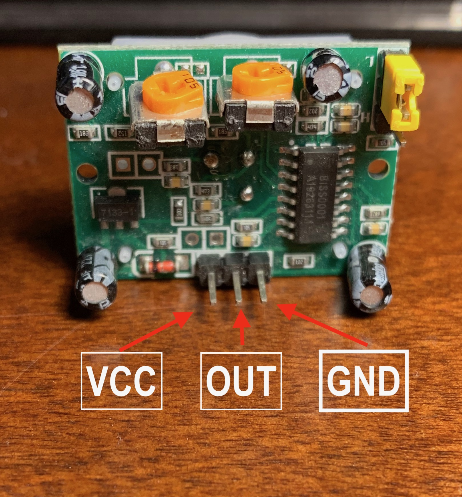
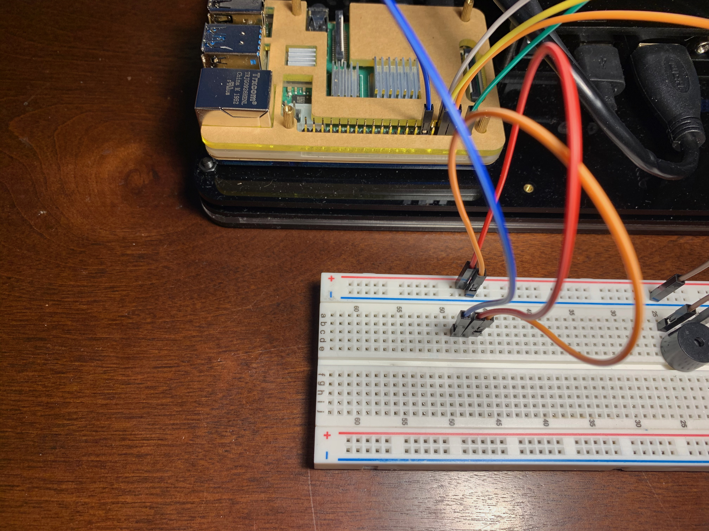
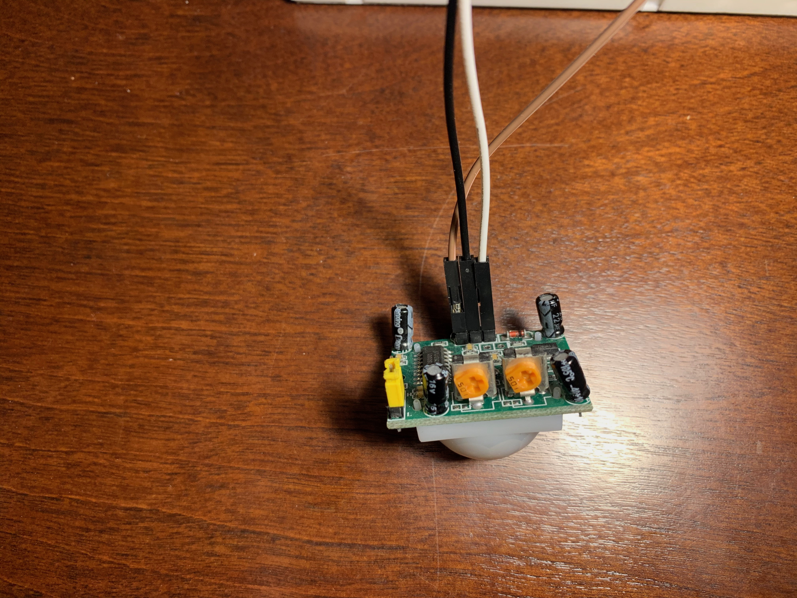
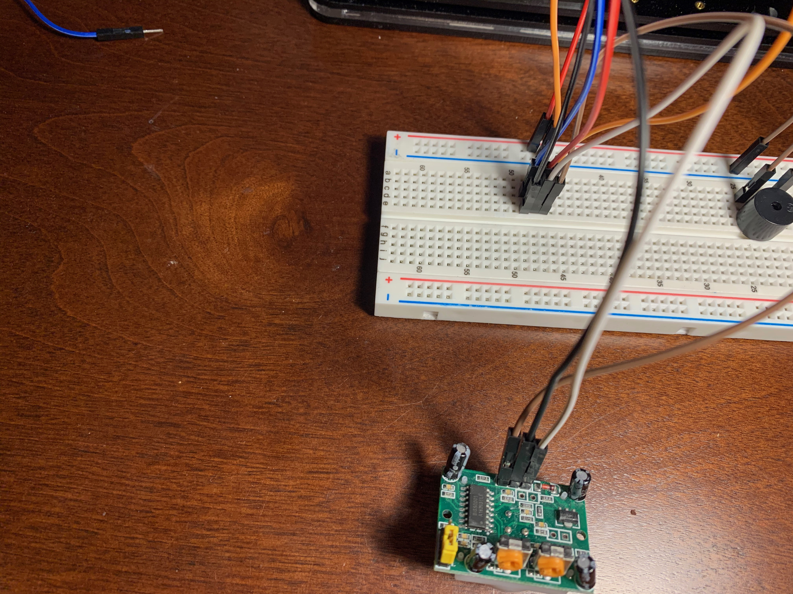

<h1>The FamCam Motion Detection Device</h1>

In this workshop, the student will learn:
- How to wire and use more peripheral devices
- How to use functions aacross multiple files to build a project
- How to use the Python SMTP Library to send text message notifications

Here is the list of external parts you need besides your Raspberry Pi Desktop that came with your package:
- 5 Female-Male jumper wires
- 1 Male-Male jumper wires
- 1 LED Light
- 1 330 Ohm Resistor
- 1 Buzzer

Before getting started, each student should set up a new gmail account to use for the notifcation service. <a href='https://accounts.google.com/signup/v2/webcreateaccount?flowName=GlifWebSignIn&flowEntry=SignUp'>Follow this link to create a new gmail account.</a> Follow the naming scheme for your email "firstnamelastname.pi@gmail.com". We ask that you create a new email account because you need to allow third party applications (our soon to be created email server) access to your account.

<kbd>
    
</kbd>
<kbd>
    
</kbd>

 

> In case there are any issues, here is the <a href='https://support.google.com/mail/answer/56256?hl=en'>Gmail support link</a>.

<h2>Configuring the FamCam</h2>

In this section, we will be putting together the physical components of the FamCam. Use `pinout` on the Pi or use the image below as a reference.

    

We will be using specific coordinates on the breadboard to aid in placing jumper wires and peripheral devices. In the image below, there is a red dot, a blue dot, a green dot and a black dot on the breadboard. The red dot is at pinhole **A5**, he blue dot is at **C12**, the green dot is at **negative Rail 10**, and lastly the black dot is on **posititve Rail 3**. This is how each type of pin hole will be referred to throughout the project.

    

Although the general area on the breadboard used is not necessarily important, the grouping in how each component is wired is key to the components funcitoning correctly. Do not confuse this concept with the pins on the Pi though. The difference between **3V3**, **5V**, **GND**, and **GPIO#** pins differ greatly in their purpose and funcionality.

1. First, connect two female-male wires to a **5V** and **GND** pin on the Pi. Just as the workshop, any pin labeled as such would work, but for this project we are using *physical pin 2* for the **5V** pin and *physical pin 6* for the **GND** pin. Connect the male end of the **5V** wire to **Positive Rail 3** of the breadboard and the male end of the **GND** wire to **negative Rail 3** of the breadboard. 

    

2. Place an LED on the breadboard, with the positive leg (the longer leg) in **E10**, and the negative leg in **E11**. Then Connect a female-male wire from **GPIO14** to **A10**. Next, connect an Ohm Resistor to the female end of a female-male jumper wire. Connect the Ohm resistor side to **C11** and the male end of the wire to **negative rail 11**.

    
    

3. Next, place the buzzer on the breadboard with the positive leg at **E22** and the negative leg at **E25**. Use a female-male jumper wire to connect **GPIO4** to **B22** and a male-male jumper wire to connect from **negative rail 25** to **B25**.
> The positive leg is the leg that has a "+" on top of the buzzer. It is a little tough to see so look closely.

    
    

Lastly, we are going to connect the motion sensor. This does not go directly on the board like the other peripheral devices. As pictured below with the motion sensor pins on the bottom, the left most pin is the **VCC** pin which is used for voltage, the middle pin is an **OUT** pin to communicate with the Pi, and the right-most pin is the **GND** pin.

    

4. We will use the jumper wires to connect the Pi to the breadboard and then the breadboard to the motion sensor. First, connect a male-male wire from **positive rail 48** of the breadboard to **C48**. Then connect a female-male wire from **GPIO18** to **C49**. Lastly, use a male-male wire to connect **negative rail 47** of the breadoard to **C47**. 

    

5. Use a female-male wire to connect the **VCC** pin on the motion sensor to **E48**. Use a female-male wire to connect the **OUT** pin on the motion sensor to **E49**. Use a female-male wire to connect the **GND** pin on the motion sensor to **E47**.

    
    

<h2>Coding the FamCam</h2>

In this section, we will be creating the program that runs the FamCam. Although we will be using new peripherals such as the buzzer and motion sensor, using Python to code them will feel familiar as it is a similar process as the peripherals in workshop 3.

1. In your *python-work* folder, create a new folder called *project-1*. In *project-1*, create a file named "fam_cam.py".

2. First we need to import the `datetime` module. This is a Python module used for it's ability to create time stamps. Since we will eventually be using a notification system, it's a good idea to know when someone sets off the motion detector.

        from datetime import datetime 

3. Now we can import the three classes we will need from the gpiozero library; Buzzer, LED, and MotionSensor. When the motion sensor is set off, the LED light and buzzer will be triggered as well. We will also import the pause function from the signal module just as we did in workshop 3.

        from gpiozero import Buzzer, LED, MotionSensor
        from signal import pause

4. Let's instantiate each peripheral class with its respective GPIO pin. Remember we used **GPIO4** for the buzzer, **GPIO14** for the LED light, and **GPIO18** for the motion sensor.

        buzzer = Buzzer(4)
        led = LED(14)
        motion_sensor = MotionSensor(18)

5. We shoudld also store the timestamp in a variable so it is easy to use in the rest of our program. We can do so with the following:

        detection = datetime.now() # .now() is a function of the datetime class that creates the timestamp

6. Next, we want to create two functions, one that runs when motion is detected, and another that runs afterwards.
    - The first function we create will be `start_motion()`. This will be called when the motion sensor goes off. In this function, we will call the LED light to blink every 0.5 seconds, turn on the buzzer to beep every 0.5 seconds, and print the time the motion sensor is triggered as an output to the terminal.
    - Second, we need a function `end_motion()` that will stop the led light and buzzer from going off. Creating this function will eliminate the need to constantly restart your program and instead continue running.

                        def start_motion():
                        led.blink(0.5, 0.5)
                        buzzer.beep(0.5, 0.5) # This is a method of the Buzzer class. (Watch out its pretty loud!)
                        print(f"Motion detected at {detection}")

                        def end_motion():
                        if(detection): # "If detection has a value, then we want to turn off the led and buzzer"
                                led.off() # Method to turn off the LED light
                                buzzer.off() # Method to turn off the buzzer

6. Lastly for this file, we want to print to the terminal when we are starting up the motion sensor and when the sensor is ready. Of course we will also need to store the custom functions as the respective motion sensor methods.

To do so, we will use three methods from the MotionSensor class. The first being "wait_for_no_motion()". This method prevents the motion sensor from going off immediately on startup. The second method is ".when_motion()", which is what is triggered when the motion sensor detects any motion. Lastly, ".when_no_motion()" is used when the motion sensor is no longer detecting motion.

        print("Starting up the sensor...")
        motion_sensor.wait_for_no_motion()
        print("Sensor ready")
        motion_sensor.when_motion = start_motion
        motion_sensor.when_no_motion = end_motion

        pause()

Here is a complete version of fam_cam.py just incase there were any hiccups along the way!

        from datetime import datetime
        from gpiozero import Buzzer, LED, MotionSensor
        from signal import pause

        buzzer = Buzzer(4)
        led = LED(14)
        motion_sensor = MotionSensor(18)

        detection = datetime.now() # .now() is a function of the datetime class that creates the timestamp

        def start_motion():
            led.blink(0.5, 0.5)
            buzzer.beep(0.5, 0.5) # This is a method of the Buzzer class. (Watch out its pretty loud!)
            print(f"Motion detected at {detection}")

        def end_motion():
            if(detection): # "If detection has a value, then we want to turn off the led and buzzer"
                led.off() # Method to turn off the LED light
                buzzer.off() # Method to turn off the buzzer

        print("Starting up the sensor...")
        motion_sensor.wait_for_no_motion()
        print("Sensor ready")
        motion_sensor.when_motion = start_motion
        motion_sensor.when_no_motion = end_motion

        pause()

We now have a working file. Test it out by executing the file and waving in front of the sensor. You should see an output in the terminal as well as the light and buzzer going off. In the next section, you will learn how to use an SMTP server and your newly created gmail account to send a notification any time the sensor is triggered.

<h2>SMS Alert System</h2>

In this section, we will code out the FamCam's text message notification system. The cool thing about SMTP is that even though it is an email server, it can send text messages by using SMS gateways. An sms gateway service is what allows a computer to send emails as texts by using a given phone number and carrier specific gateway. If you wanted to send a text to a Verizon number it would like: “1234567890@vtext.com”. We can then utilize the “MIME” module to structure our message. The new Gmail account you created will be used to send this message. If you still need to create the new account, <a href="https://accounts.google.com/signup/v2/webcreateaccount?flowName=GlifWebSignIn&flowEntry=SignUp">click here.</a>
> Don't forget to go allow third party app access or else the message won't send!

**Note:** Text messaging rates might apply, so keep that in mind. If that is an issue, let your teacher know.

1. In your *project-1* folder, create a new file "text_me.py". This is where we will code the SMTP server.

2. At the beginning of this file, we want to import "smtplib", "MIMEText", and "MIMEMultipart".
        
        import smtplib
        from email.mime.text import MIMEText
        from email.mime.multipart import MIMEMultipart

3. Next, define a custom function named. "texter()". In it, we will have to provide authentication so the email service can function. For this, we will set two variables; "email" and "password" to store our new email and password to that email as a string. Below is our function so far:

        def texter():
            email = "your.email.here@gmail.com"
            password = "INSERT PASSWORD FOR ABOVE EMAIL"

4. Next we need to store the SMS Gateway address to send the notification to. This can be different depending on your cell phone provider. A list of some major providers and their gateway service addresses can be found <a href="https://dev.to/mraza007/sending-sms-using-python-jkd">here</a>. We will store this in a variable "sms_gateway" and our function now currently looks like the below: 

        def texter():
            email = "your.email.here@gmail.com"
            password = "INSERT PASSWORD FOR ABOVE EMAIL"

            sms_gateway = "PHONE_NUMBER@CARRIER_GATEWAY"

5. Lastly for variables, we need to specify the server and port that it will run on. We will be using the default smtp server and default port. Using these will establish a secure TLS connection. Once the connection is established, we use that to login to the created email and password from earlier.

> TlS is short for "Transport Layer Security" and is the latest security protocol used for ecrypting data and information while its trasferred through the internet.

The "texter()" function now looks like the below:

        def texter():
            email = "your.email.here@gmail.com"
            password = "INSERT PASSWORD FOR ABOVE EMAIL"

            sms_gateway = "PHONE_NUMBER@CARRIER_GATEWAY"

            smtp = "smtp.gmail.com"
            port = 587

            # This starts the email server
            server = smtplib.SMTP(smtp,port)

            server.starttls()

            server.login(email,password)

6. It's time to create the message. First we store the "MIMEMultipart()" function in the variable "msg". We then define the 'From' and 'To' which will be the new email created and the sms gateway variable we defined earlier reapectively. We can set the 'Subject' as well to be "FamCam Alert".

After doing so, we will store the body of our message in a variable called "body". We will want to pass the timestamp from earlier into the body of the message as well. We can do this by setting a parameter in the "texter()" function and using f shorthand to pass it to the body. The "texter()" function will now look like the below:

        def texter(timestamp):
            email = "your.email.here@gmail.com"
            password = "INSERT PASSWORD FOR ABOVE EMAIL"

            sms_gateway = "PHONE_NUMBER@CARRIER_GATEWAY"

            smtp = "smtp.gmail.com"
            port = 587

            # This starts the email server
            server = smtplib.SMTP(smtp,port)

            server.starttls()

            server.login(email,password)

            msg = MIMEMultipart()
            msg['From'] = email
            msg['To'] = sms_gateway

            msg['Subject'] = "FamCam Alert!\n" # "/n" is used to indicate a new line should be used for the next output
            body = f"Motion has been detected at {timaestamp}!\n"

7. Lastly, we want to attach the body to the message as plaintext using ".attach()" and use the ".as_string()" function to assure the message is read as a string. This will be stored in the variable "sms". Then we send the text and quit out of the server. The complete function now looks like the below:

        def texter(timestamp):
            email = "your.email.here@gmail.com"
            password = "INSERT PASSWORD FOR ABOVE EMAIL"

            sms_gateway = "PHONE_NUMBER@CARRIER_GATEWAY"

            smtp = "smtp.gmail.com"
            port = 587

            # This starts the email server
            server = smtplib.SMTP(smtp,port)

            server.starttls()

            server.login(email,password)

            msg = MIMEMultipart()
            msg['From'] = email
            msg['To'] = sms_gateway

            msg['Subject'] = "FamCam Alert!\n" # "/n" is used to indicate a new line should be used for the next output
            body = f"Motion has been detected at {timaestamp}!\n"

            msg.attach(MIMEText(body, 'plain'))

            sms = msg.as_string()

            server.sendmail(email,sms_gateway,sms)

            server.quit()

8. To use our newly created function, we must import it into "fam_cam.py". We can add the import statement to the top of the file.

        from text_me import texter

9. We also need to call the "texter()" function at the end of "start_motion()" and pass the variable "detection" as an argument. The final "fam_cam.py" will look like the following:

        from datetime import datetime
        from gpiozero import Buzzer, LED, MotionSensor
        from signal import pause
        from text_me import texter # new import statement

        buzzer = Buzzer(4)
        led = LED(14)
        motion_sensor = MotionSensor(18)

        detection = datetime.now() # .now() is a function of the datetime class that creates the timestamp

        def start_motion():
            led.blink(0.5, 0.5)
            buzzer.beep(0.5, 0.5) # This is a method of the Buzzer class. (Watch out its pretty loud!)
            print(f"Motion detected at {detection}")
            texter(detection) # calling the texter function and passing through detection

        def end_motion():
            if(detection): # "If detection has a value, then we want to turn off the led and buzzer"
                led.off() # Method to turn off the LED light
                buzzer.off() # Method to turn off the buzzer

        print("Starting up the sensor...")
        motion_sensor.wait_for_no_motion()
        print("Sensor ready")
        motion_sensor.when_motion = start_motion
        motion_sensor.when_no_motion = end_motion

        pause()

**Note:** A common error is failed authentication, meaning one of two things:
1. You could have mistyped your email or password in the "text_me()" function. Re-check that first.
2. If the error persists after option 1, third party app access might not be set to allow access. Please re-check step <!-- FIXME: add step # --> 

Great! You should have a working motion detection and notification system. Let's recap on how we did it.

Takeaways:
- Learned how to configure two new peripherals, the buzzer and motion sensor
- Imported and implmented the datetime module
- Imported a function from a file in the same directory
- Used an SMTP server to send an SMS notification