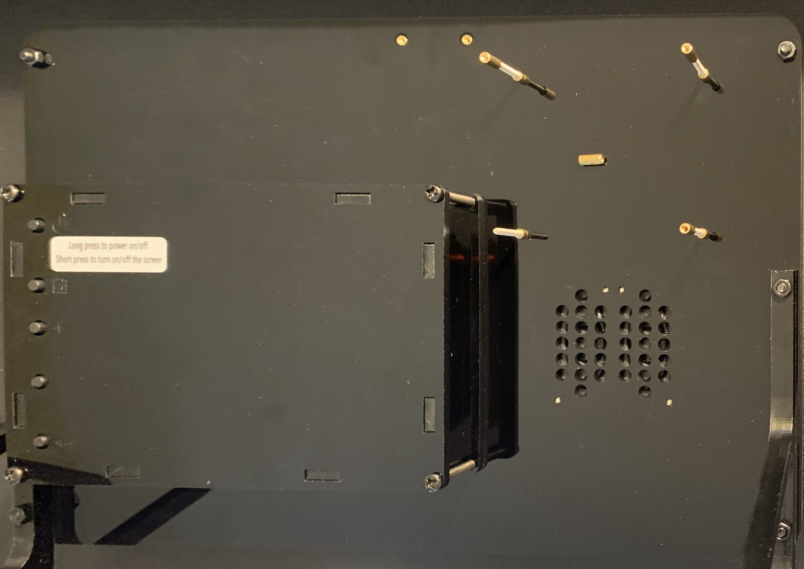
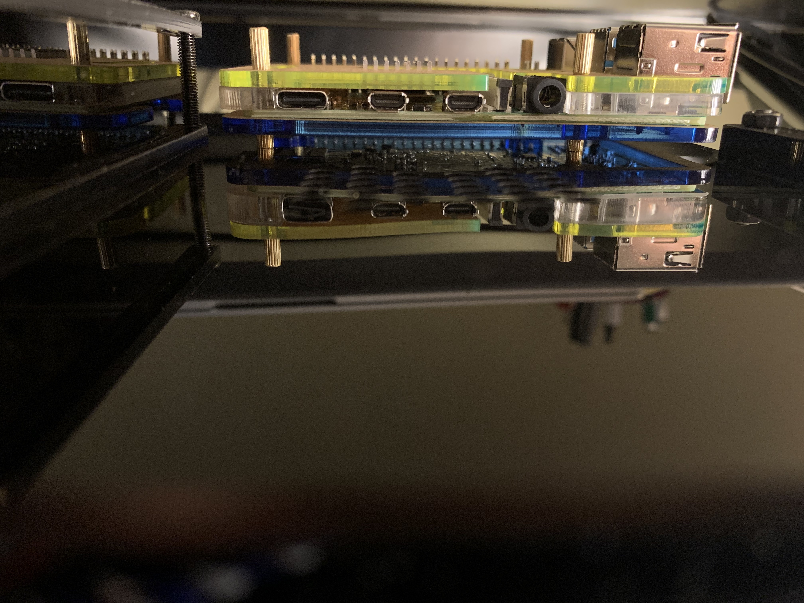

<link href="style.css" rel="stylesheet"></link>

# Setting up your Raspberry Pi

1. First we are going to add the heat sinks to the Raspberry Pi (going forward it will be referred to as the Pi.)

    a. As you can see, your Pi comes with 3 heat sinks designed to keep **[INSERT 3 COMPONENTS HEAT SINKS ARE USED ON]** cool. The below picture labels where each heat sink belongs on the Pi.
        
    

    
    

    b. Place Pi guard #3 as pictured below on the pi to help place the heat sinks on the Pi. 

    

    
    
    
    
    
    
    

    c. After placing the heat sinks on the Pi, you should see the folling:
    

    
    

> Heat sinks keep the Pi cool to prevent it from overheating.

2. Insert the microSD card into the port on the bottom of the Pi.
    <!-- Images are JPEG  -->
    

    
    
    
    
    
    
    

3. Remove the washers from the back of the display monitor. Make sure to keep these in a safe spot as they will be needed later.
    
    

    
    

4. Place Pi guard #1 on the back of the display as shown below:

    

    
    
    
    
    
    
    

5. Place the Pi on top of the guard on the back of the display monitor.
    * The ethernet and USB ports should be facing away from the middle of the display.

    

    
    

6. Place the plastic guard (#2) followed by the final guard (#3) on top of the Pi. Then screw each washer back on so that there is not room for the Pi to move, but there is not pressure on the Pi.
    
    

    
    
    
    
    
    
    

7. Below are the USB-C cable and the micro-HDMI cables as well as their corresponding Pi ports.
    a. The USB-C provides power to the Pi.
    b. The micro-HDMI cable is used to display the GUI of the Pi.

    

    
    
    
    
    
    
    

8. Plug in the USB-C into the display and then into the Pi as shown below:

    

    
    
    
    
    
    
    

9. Repeat step 9 for the micro-HDMI cable as shown below:

    

    
    
    
    
    
    
    

10. Below is the power supply chord for the display which in turn also provides power for the Pi. Plug in to the display and a wall outlet to get started.

    

    
    
    
    
    
    
    

## Now your hardware is all set up. Move on to the next portion to set up Raspbian.
