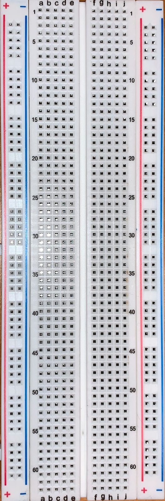
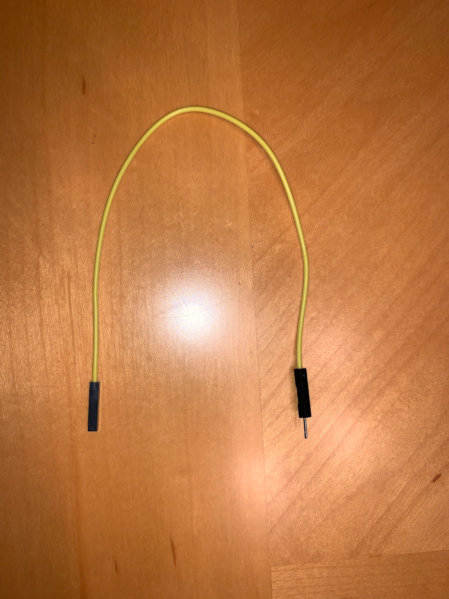
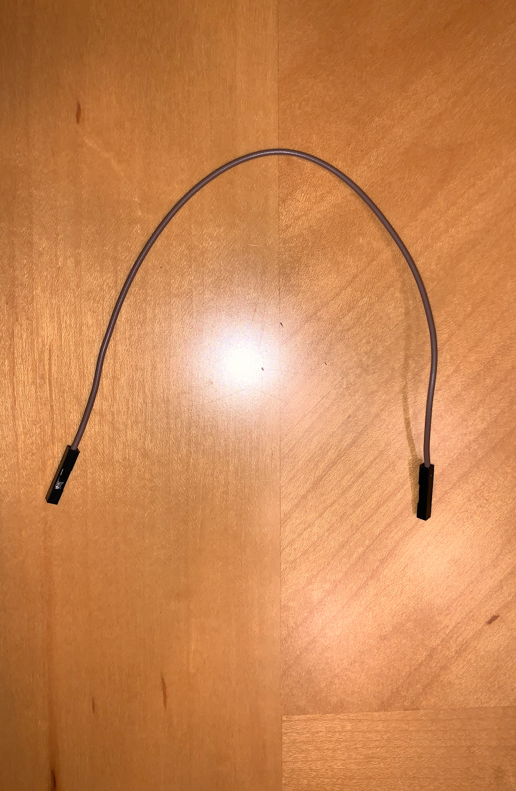
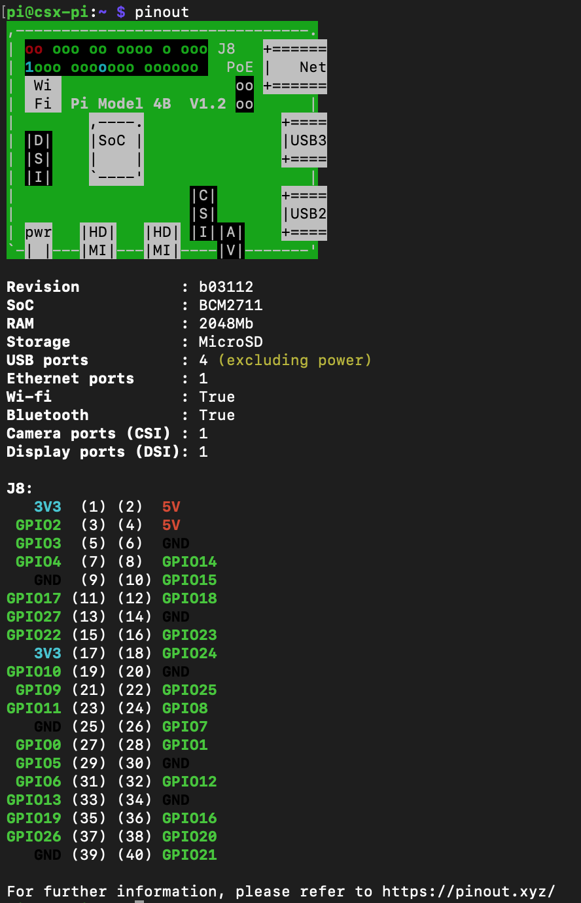

<h1>USing the I/O Devices with Your Raspberry Pi</h1>

In this workshop, the student will learn how to properly connect each of the five (5) peripheral devices to the Pi and make them functional using Python. All students should have the Pi turned on and ready to use for the remainded of the workshop.

As a reminder, here is the list of external parts you need besides your Raspberry Pi Desktop that came with your package:

- One (1) Breadboard
- Fifteen (15) Male-Male Jumper Wires
- Fifteen (15) Female-Male Jumper Wires
- Fifteen (15) Female-Female Jumper Wires
- One (1) Motion Sensor
- Five (5) LED Lights (Assorted colors)
- Three (3) Tactile Buttons
- One (1) Buzzer
- Three (3) Ohm Resistors

<h2>The Physical Components</h2>

<h4>1. The Breadboard</h4>

A breadboard is a device used for temporary or prototype electronics. Breadboards are solderless, meaning that there is no need to melt any wires to allow for an electrical current to pass through.

    

There are **three (3)** types of rails on the breadboard we are using. The **red line** marks the *positive* rail, the **blue line** marks the *negative* rail, and the **component rails** are each row of *five pin holes*. Your breadboard has two sides of each seperated by a canal in the middle. Utilizing the different rails will be gone over for each I/O device later in the workshop.

<h4>2. Jumoer Wires</h4>

Female to Male:

    

<i>In the image you can see one side of the wire is used to plug <ins>into another device</ins>, while the opposite side is used to plug <ins>other devices into it</ins>.</i>

 

Female to Female:

    

<i>Both ends of the wire are used to plug <ins>other devices into it</ins>.</i>

 

Male to Male:

    

<i>Both ends of the wire are used to plug <ins>into other devices</ins>.</i>

<h4>3. The GPIO Pins</h4>

    

Now you have heard a little bit about GPIO pins earlier in the semester. GPIO is short for "General Purpose Input/Output". An important thing to note right off the bat is that not all pins act the same . Some pins can provide a power *output* such as <ins>3v3 and 5v pins</ins>, others can receive and measure power *inputs* like <ins>"gnd" or ground pins</ins>. Over all though, a majority of the pins are used for reading inputs or providing outputs. 

How can we tell the difference between the pins? The GPIO Zero Python Library provides a comand line tool that is installed by default on your Raspberry Pi, so users can have a better understanding of their Pi. Open the terminal and enter in the prompt, `pinout`. You will see the following:

    

This provides a layout of each pin on your Raspberry Pi and they type of pin it is. You can also see it provides some information on where some of the physical components of your pi are for reference as well.

Now that we have a better idea about some of the compopnents we will be using to make our i/o devices functional, let's start using them.

Open VS Code on your Pi and in your *python-work* folder, create a folder named *workshop_3*. Inside the *workshop_3* folder, create a file named "button.py".

<h2>Tactile Button</h2>

A tactile button can be used to give inputs to your Raspberry Pi by clicking the button while a program is running. This clasifies the tactile button as an **input** device.
